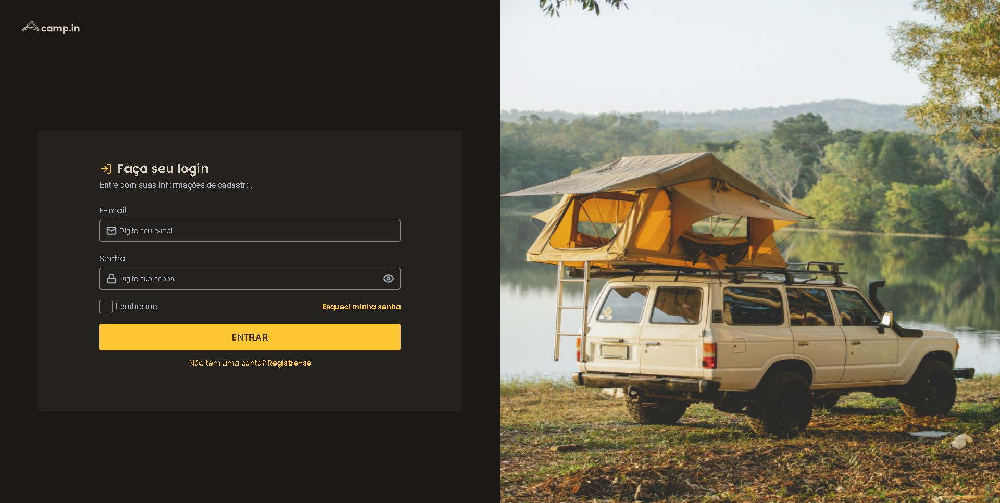
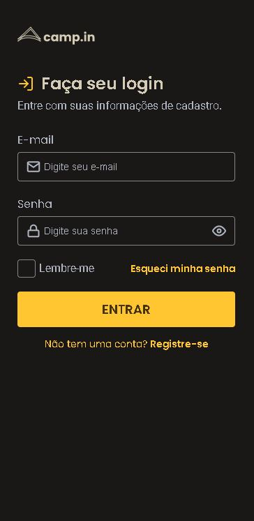

<h1 align="center"> Desafio Rocketseat - Login Form CSS </h1>

Desafio da plaforma Rocketseat, em que deve reproduzir um design de uma página de login em figma.

<a href="#tecnologias">Tecnologias</a>&nbsp;&nbsp;&nbsp;|&nbsp;&nbsp;&nbsp;
<a href="#projeto">Projeto</a>&nbsp;&nbsp;&nbsp;|&nbsp;&nbsp;&nbsp;
<a href="#layout">Layout</a>&nbsp;&nbsp;&nbsp;|&nbsp;&nbsp;&nbsp;
<a href="#memo-licença">Licença</a>

 

Imagem da Página Login Form CSS Desktop (Imagem 1).

 

Imagem da Página Login Form CSS Mobile (Imagem 2).

## Tecnologias

Esse projeto foi desenvolvido com as seguintes tecnologias:

- HTML e CSS
- Git e Github

## Projeto

O projeto Login Form CSS é uma página de login feita somente em HTML e CSS, com foco em estilização de formulário, e com media queries para responsividade.

## Layout

Você pode visualizar o layout do projeto através [DESSE LINK](https://www.figma.com/file/SX8XFyC5fAY09ai8Oykz0T/DD-%2F-Login-Form---CSS/duplicate). É necessário ter conta no [Figma](https://figma.com) para acessá-lo.

## :memo: Licença

Esse projeto está sob licença MIT.

---

Projeto realizado pela Rocketseat e feito e adaptado por Victor Pimenta. [LinkedIn](https://www.linkedin.com/in/victor-cardoso-pimenta-0250371a0/)